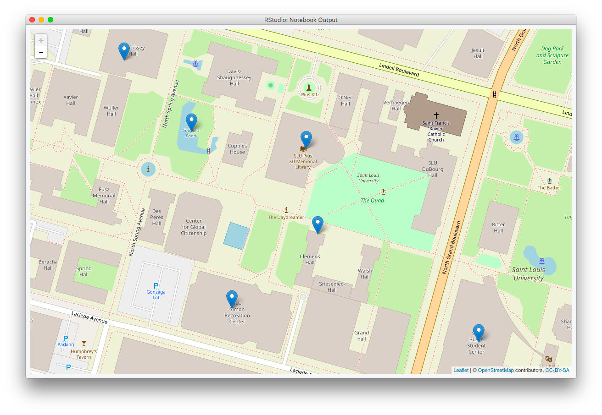

Lecture 10 Notebook
================
Christopher Prener, Ph.D.
(March 22, 2018)

Introduction
------------

This is the lecture notebook for Lecture-10 from the course SOC 4650/5650: Introduction to GISc.

Load Dependencies
-----------------

The following code loads the package dependencies for our analysis:

``` r
library(leaflet) # interactive mapping
library(sf)    # spatial data tools
```

    ## Linking to GEOS 3.6.1, GDAL 2.1.3, proj.4 4.9.3

Load Data
---------

We'll use two data sets from the `stlData` package to practice projecting data and working with coordinate systems:

``` r
library(stlData)
stl <- stl_sf_boundary
campus <- stl_tbl_sluPlaces
```

Working with Coordinate Systems
-------------------------------

To begin, we'll explore the projection data for the `stl` object:

``` r
stl
```

    ## Simple feature collection with 1 feature and 4 fields
    ## geometry type:  POLYGON
    ## dimension:      XY
    ## bbox:           xmin: -90.32052 ymin: 38.53185 xmax: -90.16657 ymax: 38.77443
    ## epsg (SRID):    4269
    ## proj4string:    +proj=longlat +datum=NAD83 +no_defs
    ##   GEOID           NAME LAND_SQMI WATER_SQMI                       geometry
    ## 1 29510 St. Louis City   61.9532   4.119725 POLYGON ((-90.32052 38.5941...

We can see that the `epsg` value is `4269`. When we look at the `proj4string` value, we see a reference to the `NAD83` datum. If we [look up the given `epsg` value of `4269`](http://spatialreference.org/ref/epsg/4269/), we will see that it is for the `NAD 1983` geographic coordinate system. This gives us a starting place.

It is also possible to get just the top portion of the output above that tells us about the projection system used by the `sf` object using the `st_crs()` function:

``` r
st_crs(stl)
```

    ## Coordinate Reference System:
    ##   EPSG: 4269 
    ##   proj4string: "+proj=longlat +datum=NAD83 +no_defs"

If we needed to re-project the data using a different coordinate system, we can use `st_transform()` to do so. For instance, we could convert the `stl` data to WGS 1984 using the epsg code `4326`:

``` r
stl_wgs <- st_transform(stl, crs = 4326)
```

With the change made, we can again check the object's metadata:

``` r
stl_wgs
```

    ## Simple feature collection with 1 feature and 4 fields
    ## geometry type:  POLYGON
    ## dimension:      XY
    ## bbox:           xmin: -90.32052 ymin: 38.53185 xmax: -90.16657 ymax: 38.77443
    ## epsg (SRID):    4326
    ## proj4string:    +proj=longlat +datum=WGS84 +no_defs
    ##   GEOID           NAME LAND_SQMI WATER_SQMI                       geometry
    ## 1 29510 St. Louis City   61.9532   4.119725 POLYGON ((-90.32052 38.5941...

Projecting x,y Data
-------------------

We can also use `sf` to convert tabular data that contains x,y coordinates to a simple features object. We need to have a sense of a few important points. First, we need to know the names of the `x` and `y` coordinate variables:

``` r
campus
```

    ## # A tibble: 6 x 4
    ##      id name             lng   lat
    ##   <dbl> <chr>          <dbl> <dbl>
    ## 1    1. Morrissey Hall -90.2  38.6
    ## 2    2. Starbucks      -90.2  38.6
    ## 3    3. Simon Rec      -90.2  38.6
    ## 4    4. Pius Library   -90.2  38.6
    ## 5    5. BSC            -90.2  38.6
    ## 6    6. The Pond       -90.2  38.6

Longitude, or `lng` in this case, is *always* the `x` coordinate. Latitude, or `lat` in this case, is *always* the `y` coordinate.

We also need to know the coordinate system that was used to create the `x` and `y` coordinate columns. This can be tricky to ascertain. The data above are easy to identify as decimal degrees data, but it isn't always quite that simple. For decimal degrees data, we can project them using a geographic coordinate system. We typically use NAD 1983 for this in the U.S., but WGS 1984 works as well.

### Completing the Projection

We'll use the `epsg` value `4269` for NAD 1983 here to actually project the data using the `st_as_sf()` function:

``` r
campus_sf <- st_as_sf(campus, coords = c("lng", "lat"), crs = 4269)
```

The `st_as_sf()` function takes the data, our specification for the `crs`, and the given `x` and `y` coordinates and returns a simple features object:

``` r
campus_sf
```

    ## Simple feature collection with 6 features and 2 fields
    ## geometry type:  POINT
    ## dimension:      XY
    ## bbox:           xmin: -90.2371 ymin: 38.63497 xmax: -90.23296 ymax: 38.63755
    ## epsg (SRID):    4269
    ## proj4string:    +proj=longlat +ellps=GRS80 +towgs84=0,0,0,0,0,0,0 +no_defs
    ## # A tibble: 6 x 3
    ##      id name                             geometry
    ##   <dbl> <chr>              <sf_geometry [degree]>
    ## 1    1. Morrissey Hall  POINT (-90.2371 38.63755)
    ## 2    2. Starbucks      POINT (-90.23484 38.63596)
    ## 3    3. Simon Rec      POINT (-90.23584 38.63528)
    ## 4    4. Pius Library   POINT (-90.23497 38.63674)
    ## 5    5. BSC            POINT (-90.23296 38.63497)
    ## 6    6. The Pond        POINT (-90.23631 38.6369)

We now get both the geometric data and metadata when we print the `campus_sf` object.

### Checking the Project

Given the uncertainty that often exists with projecting x,y data, we should always check our projects (see the lecture slides for some examples of how this can go wrong!). We'll use `leaflet`, the interactive mapping tool, to check our data. The interactivity and easy-to-read basemaps help tremendously in checking our work, and `leaflet` is preferred over `ggplot2` for this reason.

``` r
leaflet() %>%
  addTiles() %>%
  addMarkers(data = campus_sf)
```

    ## Warning: sf layer has inconsistent datum (+proj=longlat +ellps=GRS80 +towgs84=0,0,0,0,0,0,0 +no_defs).
    ## Need '+proj=longlat +datum=WGS84'

<!--html_preserve-->

<script type="application/json" data-for="htmlwidget-adaaa7fc83267424fd4a">{"x":{"options":{"crs":{"crsClass":"L.CRS.EPSG3857","code":null,"proj4def":null,"projectedBounds":null,"options":{}}},"calls":[{"method":"addTiles","args":["//{s}.tile.openstreetmap.org/{z}/{x}/{y}.png",null,null,{"minZoom":0,"maxZoom":18,"maxNativeZoom":null,"tileSize":256,"subdomains":"abc","errorTileUrl":"","tms":false,"continuousWorld":false,"noWrap":false,"zoomOffset":0,"zoomReverse":false,"opacity":1,"zIndex":null,"unloadInvisibleTiles":null,"updateWhenIdle":null,"detectRetina":false,"reuseTiles":false,"attribution":"&copy; <a href=\"http://openstreetmap.org\">OpenStreetMap<\/a> contributors, <a href=\"http://creativecommons.org/licenses/by-sa/2.0/\">CC-BY-SA<\/a>"}]},{"method":"addMarkers","args":[[38.637547,38.635959,38.635283,38.636741,38.634973,38.636897],[-90.237104,-90.234837,-90.235841,-90.234972,-90.232955,-90.236313],null,null,null,{"clickable":true,"draggable":false,"keyboard":true,"title":"","alt":"","zIndexOffset":0,"opacity":1,"riseOnHover":false,"riseOffset":250},null,null,null,null,null,null,null]}],"limits":{"lat":[38.634973,38.637547],"lng":[-90.237104,-90.232955]}},"evals":[],"jsHooks":[]}</script>
<!--/html_preserve-->
Excellent! Our data project and appear to be on campus. This is a good sign. If they appeared out at sea or in a different part of the country, we would need to check that the columns and the `crs` value were specified correctly.

We did, however, get a warning from `leaflet()` about the layer having an "inconsistent datum". Leaflet wants all of the data mapped to be in WGS 1984. We can easily rectify this using `st_transform()`:

``` r
campus_sf_wgs <- st_transform(campus_sf, crs = 4326)
```

With that change made, we can make our interactive map again without any warnings:

``` r
leaflet() %>%
  addTiles() %>%
  addMarkers(data = campus_sf_wgs)
```

<!--html_preserve-->

<script type="application/json" data-for="htmlwidget-54bb6ca2e84b338e8cb9">{"x":{"options":{"crs":{"crsClass":"L.CRS.EPSG3857","code":null,"proj4def":null,"projectedBounds":null,"options":{}}},"calls":[{"method":"addTiles","args":["//{s}.tile.openstreetmap.org/{z}/{x}/{y}.png",null,null,{"minZoom":0,"maxZoom":18,"maxNativeZoom":null,"tileSize":256,"subdomains":"abc","errorTileUrl":"","tms":false,"continuousWorld":false,"noWrap":false,"zoomOffset":0,"zoomReverse":false,"opacity":1,"zIndex":null,"unloadInvisibleTiles":null,"updateWhenIdle":null,"detectRetina":false,"reuseTiles":false,"attribution":"&copy; <a href=\"http://openstreetmap.org\">OpenStreetMap<\/a> contributors, <a href=\"http://creativecommons.org/licenses/by-sa/2.0/\">CC-BY-SA<\/a>"}]},{"method":"addMarkers","args":[[38.637547,38.635959,38.635283,38.636741,38.634973,38.636897],[-90.237104,-90.234837,-90.235841,-90.234972,-90.232955,-90.236313],null,null,null,{"clickable":true,"draggable":false,"keyboard":true,"title":"","alt":"","zIndexOffset":0,"opacity":1,"riseOnHover":false,"riseOffset":250},null,null,null,null,null,null,null]}],"limits":{"lat":[38.634973,38.637547],"lng":[-90.237104,-90.232955]}},"evals":[],"jsHooks":[]}</script>
<!--/html_preserve-->
The final map image from `leaflet()` is included here since interactive objects are not included in knit documents:


